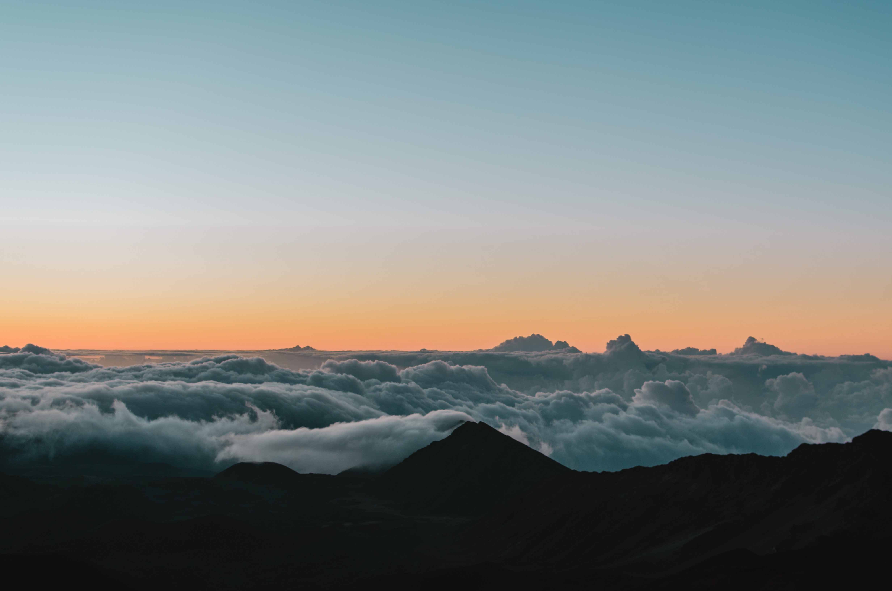
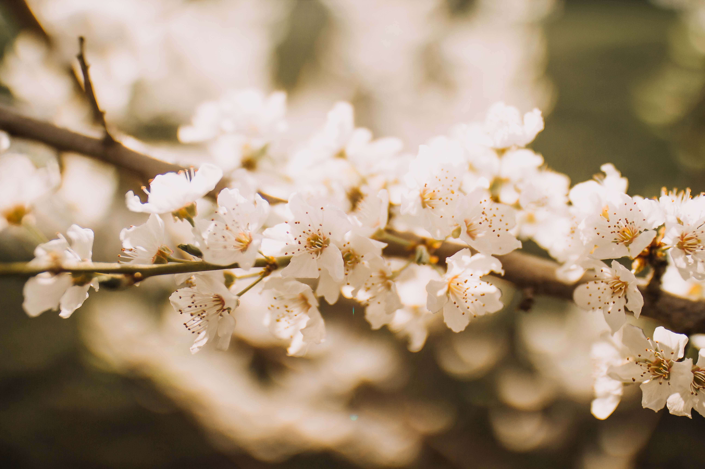

# Unsplash Wallpaper

个人私藏的壁纸，全部素材取自于 [Unsplash](https://unsplash.com/)。

## 随机

``` bash
> clone https://github.com/DoooReyn/unsplash-wallpaper.git
> cd unsplash-wallpaper
> npm install
> npm run random
```

## 展示






